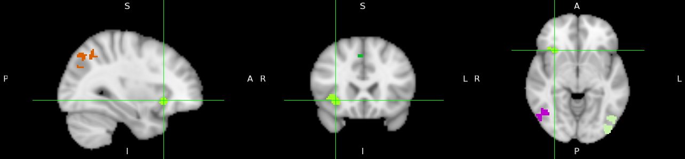
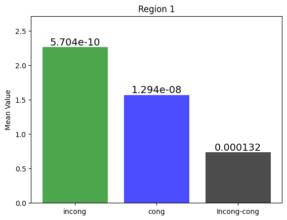

# Overview
We explore the cognitive control process by analyzing the [Flanker dataset](https://openfmri.org/dataset/ds000102/) using [FSL](https://ftp.nmr.mgh.harvard.edu/pub/dist/freesurfer/tutorial_packages/OSX/fsl_501/doc/index.html) software tool. For the purposes of this study, we define cognitive control as the ability to ignore irrelevant stimuli in order to perform a task accurately. 

# Dataset Review 
The dataset comprises **26** subjects, each with a structural MRI scan      **(T1-weighted)** and **2** sessions (runs) of functional MRI **(T2\*-weighted)**. Each session includes a sequence of cognitive control tasks, specifically congruent and incongruent trials. 

  

# Task Review 
The subject is shown a fixation cross in order to focus on the center of the screen, and then either a Congruent 
or Incongruent Flanker trial is presented for **2000ms**. During the trial the subject presses either 
the left or right button. A jittered interval follows which lasts anywhere from **8,000ms to 
14,000ms**. (Note that jittered intervals typically increment in seconds; in this case, the jitter for 
a given trial would be a random selection of one of the following: **8,000ms, 9,000ms, 10,000ms, 
11,000ms, 12,000ms, 13,000ms, and 14,000ms**) Another fixation cross is presented to begin 
the next trial.

  

# Analysis Outlines

1. [Dataset Inspection](#dataset-inspection)
2. [Data Preprocessing](#data-preprocessing)
   - Brain Extraction
   - Motion Correction
   - Slice-Time Correction
   - Smoothing
   - Registration and Normalization
3. [Statistical Analysis](#statistical-analysis)
   - 1st Level Analysis
   - 2nd Level Analysis
   - 3rd Level Analysis
4. [ROI Analysis](#roi-analysis)

# Glimpse at Each Stage 

## Dataset Inspection
Before jumping into the pre-processing stage, it’s a good practice to inspect your dataset to
 get some sense about its quality, in what is known as Quality Control. In this stage, we
 have explored the dataset manually to report any artifacts or noise in either the functional or
 structural MRI data. 

 

  

## Data Preprocessing
Practically, the **BOLD** signal (fMRI signal) measurement process is modulated with some fluctuations, or rather noise,
that are not of our interest, such as head motion, random drifts, breathing, and heartbeats.
These noisy signals are inevitable and we need to know how we could deal with them. Some of
them are periodic in somehow and could be regressed out of the data by modelling, while others
are not. This where the role of pre-processing comes in, which involves several steps including
**brain extraction, motion correction, slice time correction, smoothing and registra
tion and normalization**

  

## Statistical Analysis
 In this stage, we are ready to statistically model the activation of brain regions as well as describe
 such regions anatomically for each run of each subject. This would help us to highlight the
 regions that are likely to be involved in the task of interest. This stage includes three consecutive level of analysis, starting with **1st level analysis through 3rd level analysis**. 

  

## ROI Analysis

After conducting the statistical analysis, we came up with **6** different Regions, which might be involved in the cognitive task of interest. These regions show high statistical significance for one task over the other. To conclude which task is the more significant, we would take a mask of specific size, in our case **5 mm**. Then, extract the average z-stats for each cope of the three. After that, we would apply a **t-test** to know which one of two task contribute the most.

  
  

**For a more in-depth understanding of the methodology and analysis, please refer to the attached paper.**

## Acknowledgments

- This research project was supervised by [Dr. Meena M. Makary](https://www.linkedin.com/in/meenamakary/), who provided invaluable guidance and expertise throughout such incredible journey as a part of the FMRI course at Cairo University Faculty of Engineering.

- [Andy’s Brain Book](https://andysbrainbook.readthedocs.io/en/latest/#welcome-to-andy-s-brain-book) by [Andrew Jahn](https://medicine.umich.edu/dept/radiology/andrew-jahn-phd) was a helpful source for explanation and scripting practices.  

    

